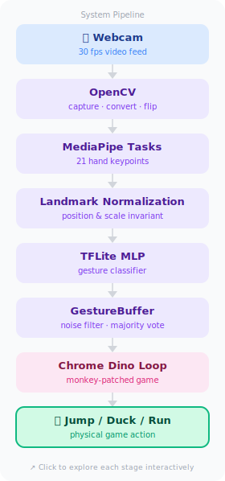

# GestureEdge — Điều Khiển Cử Chỉ Tay trên Phần Cứng Nhúng

[🇬🇧 English](README.md)

Điều khiển game Chrome Dino bằng cử chỉ tay. Ba cử chỉ. Latency inference: 0.038ms. Nhận diện cử chỉ chạy trên luồng nền, tách biệt hoàn toàn khỏi game loop.

---

## Demo

<!-- TODO: thêm GIF demo sau khi quay -->

| Cử chỉ | Hành động |
|--------|-----------|
| Bàn tay mở | Nhảy |
| Nắm đấm | Cúi |
| Ngón trỏ | Chạy |

---

## Pipeline Hệ Thống

> 👆 Click vào hình để khám phá từng bước chi tiết.

<a href="https://ChuoiUhuhu0727.github.io/gesture-edge-ai/pipeline.html">
  
</a>

*Nhận diện cử chỉ chạy trên daemon thread. Game chạy trên main thread. Hai luồng chia sẻ một biến được bảo vệ bởi `threading.Lock()`.*

---

## Quyết Định Kỹ Thuật

### 1. Chuẩn hóa landmark

Tọa độ pixel thay đổi theo vị trí tay và khoảng cách camera. Tôi chuẩn hóa mỗi frame:
1. Dịch chuyển 21 điểm về gốc cổ tay (landmark 0)
2. Chia cho giá trị tuyệt đối lớn nhất trong vector 42 chiều

Kết quả: MLP hoạt động với mọi kích cỡ bàn tay và khoảng cách camera mà không cần train lại.

### 2. Threading

Gesture inference bị block bởi I/O và thời gian chạy model. Nếu chạy bên trong game loop, frame chậm sẽ làm đứng game.

Giải pháp: inference chạy trên daemon thread, game chạy trên main thread. Hai bên chia sẻ một biến `_gesture_action` được bảo vệ bởi `Lock`. Game đọc biến này mỗi frame mà không cần chờ.

### 3. Temporal smoothing — GestureBuffer

Một frame nhiễu (ngón tay bị che một phần) có thể làm đổi class và trigger nhảy ngẫu nhiên. `GestureBuffer` dùng sliding window majority vote trên 10 frame để lọc nhiễu.

Ngoài ra, nó giữ cử chỉ ổn định trong 5 frame sau khi mất detection — brief occlusion không reset action.

```
kết quả mỗi frame (hoặc -1 = không thấy tay)
      ↓
GestureBuffer(window=10, hold_frames=5)
      ↓
cử chỉ ổn định → phím game
```

### 4. Tại sao chọn ONNX thay vì TensorRT

Tôi benchmark cả hai trước khi chọn:

| Runtime | Latency |
|---------|---------|
| ONNX CPU | **0.038 ms** |
| TensorRT GPU | 0.062 ms |

TensorRT chậm hơn 63%. Model chỉ có 1,114 parameters — quá nhỏ để GPU parallelism có lợi. Overhead memory transfer CPU↔GPU lớn hơn thời gian tính toán thực sự. TensorRT chỉ thắng với model nặng (CNN, transformer). Không phải ở đây.

### 5. Robustness với găng tay

Găng tay dày gây ra intermittent detection — landmark xuất hiện rồi biến mất ngẫu nhiên, khiến khủng long nhảy loạn.

**Giả thuyết:** MediaPipe được train trên tay trần. Găng tay thay đổi hình dạng bàn tay và che mất các nếp khớp mà detector phụ thuộc vào.

Những gì tôi đã áp dụng:
- Hạ `min_hand_detection_confidence` xuống 0.4 (từ mặc định 0.5)
- `hold_frames=5` trong GestureBuffer để bỏ qua brief miss

Cải thiện được nhưng không fix hoàn toàn. Fix triệt để cần train lại palm detector trên dữ liệu găng tay — ngoài scope dự án này.

---

## Kết Quả

| Chỉ số | Giá trị |
|--------|---------|
| Latency ONNX CPU | 0.038 ms |
| Latency TensorRT GPU | 0.062 ms |
| Số cử chỉ | 3 active / 4 trained |
| Độ chính xác classifier | 97.2% |
| Smoothing window | 10 frames |
| Hold khi mất detection | 5 frames |

---

## Tech Stack

| Layer | Công nghệ |
|-------|-----------|
| Phát hiện tay | MediaPipe Tasks |
| Classifier | TFLite MLP (42→20→10→4, 1,114 params) |
| Camera | OpenCV |
| Threading | Python `threading` |
| Runtime | ONNX Runtime (CPU) |
| Game | Chrome Dino Runner (monkey-patched) |

---

## Cài Đặt

```bash
pip install mediapipe opencv-python numpy
```

Clone Chrome Dino Runner (dependency ngoài):

```bash
git clone https://github.com/dhhruv/Chrome-Dino-Runner.git Chrome-Dino-Runner-master
```

Chạy:

```bash
python gesture_dino.py
```

Bàn phím vẫn hoạt động: `Up`/`Space` = nhảy, `Down` = cúi, `p` = tạm dừng, `ESC` = tắt camera.

---

## Credits

- Base nhận diện cử chỉ: [Kazuhito00](https://github.com/Kazuhito00/hand-gesture-recognition-using-mediapipe) (bản dịch tiếng Anh bởi [kinivi](https://github.com/kinivi))
- Game: [dhhruv/Chrome-Dino-Runner](https://github.com/dhhruv/Chrome-Dino-Runner)
